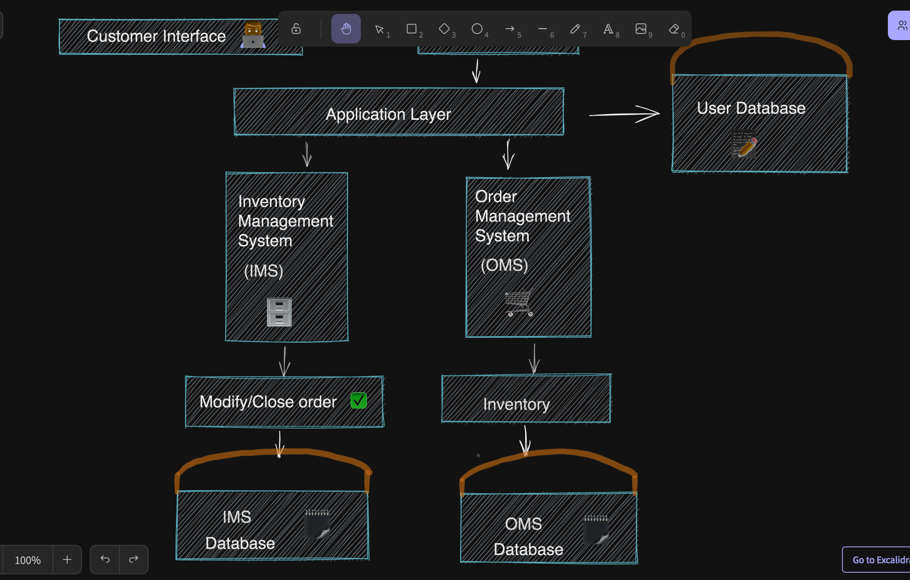
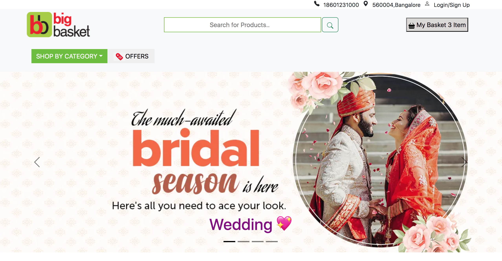
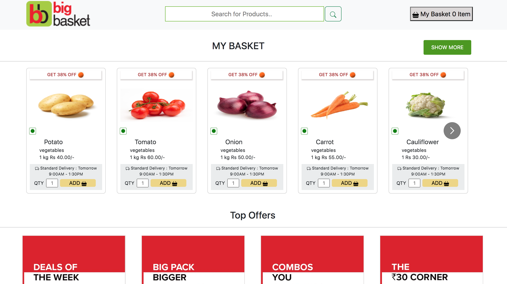
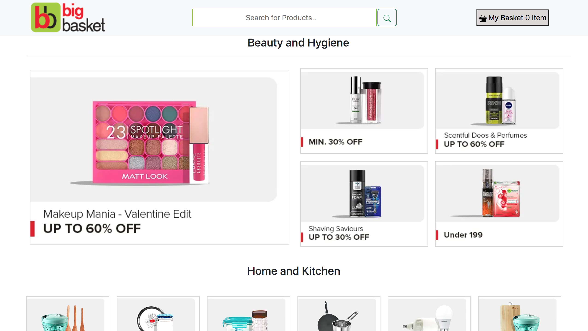

 ### `Bigbaskte clone Project 🛒`: built using following technologies  React JS, React Bootstrap.

### `👩🏻‍💻 About Developer 👩🏻‍💻`

Hey I am Neha. Frontend web Developer from Bangalore. Very much eager to explore and develop scalable, UI web applications. 

Do reach out and provide your valuable insights about the project. I appreciate your inputs.

[Linkdin](https://www.linkedin.com/in/neha-pandey-a89a5a224/)

[Findcoder](https://www.findcoder.io/u/nehap)

#### `Challenges`

- Created `React components`
- Created header,footer and many more sections
- Import React Bootstrap `Carousel`
- Import React Bootstrap `Icons`
- Import React Bootstrap `Offcanvas`
- React `Hooks` (useState,useCart)
- created `Data.js` file for all items.
- created table inside cart button
- add items in cart 
- `remove items` from cart
- Total amount to pay

### `👩‍💼 Architecture of project (Project Planning) 👩‍💼`

`🎯 Machine requirements to run this project 🎯`

Node JS (runtime environment)

` Steps to run the project in your machine `

Download the project locally
Unzip the folder
Open the unzipped folder in vscode
Rename public.env to .env
Open the .env file
Provide value to PORT variable (My suggestion: 4000)
Open new terminal to run server
Run command 1: cd backend (If your terminal is not in this directory)
Run command 2: npm install
Run command 3: npm start
Now open frontend folder

`🎉` Here you go your application is up and running... `🎉`

`❤️ Glimpse of project ❤️`

`⏳ Meta Information ⏳`

Time taken: 12 days

Upcoming Future Enhancement: 
1.User Authentication
2.Fully Responsive

`😎 Thanks for spending your valuable time on this project 😎 `

